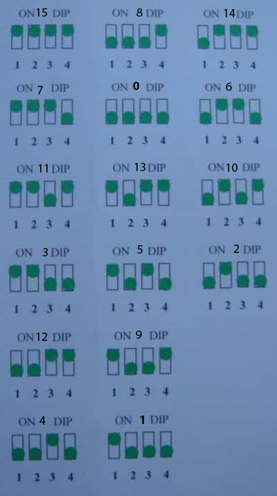

# Hampton Bay Harbor Breeze Litex UC9051T (DIP6)
- Filetype: Flipper SubGhz Key File
- Version: 1
- Frequency: 302757000 (302.757 MHz)
- Preset: FuriHalSubGhzPresetOok650Async
- Protocol: Holtek_HT12X
- Bit: 12
- TE (Transmit Enable): 333-336

## DIP Switch
| Bits | Decimal |
|------|---------|
| 1234 | DIP     |
| 1000 | 1       |
| 0100 | 2       |
| 1100 | 3       |
| 0010 | 4       |
| 1010 | 5       |
| 0110 | 6       |
| 1110 | 7       |
| 0001 | 8       |
| 1001 | 9       |
| 0101 | 10      |
| 1101 | 11      |
| 0011 | 12      |
| 1011 | 13      |
| 0111 | 14      |
| 1111 | 15      |

## Diagram

## Links
- [9051T Transmitter of Remote Control User Manual Rhine Electronics](https://fccid.io/CHQ9051T/User-Manual/User-manual-890668);
- [DIP switch](https://en.wikipedia.org/wiki/DIP_switch);
- [DMX512](https://en.wikipedia.org/wiki/DMX512);
- [HT12D/HT12F](https://www.holtek.com/page/vg/HT12D_F);
- [Replacement Remote UC7083T Hampton Bay Ceiling Fan Wireless Remote Control](https://www.amazon.com/Replacement-UC7083T-Hampton-Ceiling-Wireless/dp/B072QYD1J5).
